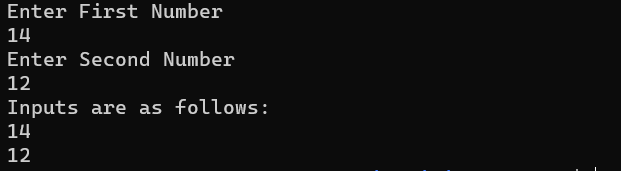
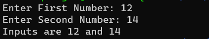

# Index
- [Hello World](#Hello-World)
- [Comments](#Comments)
- [Variables](#Variables)
- [Reading Variables](#Reading-Variables)
- [Accessing Variables](#Accessing-Variables)
- [Getting user input with prompts](#Getting-User-Inputs-With-prompts)

# Hello World
This is the code snippet for 'hello world' in shell

```bash
echo "Hello World"
```
`echo` is a keyword in shell used for printing content as shown in the example.

# Comments
Comments as you know are the most important part of a programmer's life.
In shell a comment can be declared by adding `#` symbol before the content of the comment
Example:
```bash
# this is a comment
echo "Hello World" # this is a comment
```


# Variables
Variable declaration in shell is as follows
```bash
x=1
```
Here `x` is a variable. Notice there is no space between any of the symbol.
This a note to point while writing shell. While declaring variables there should not be any space between the key and the value assigned to the key.

## Reading Variables
Reading Variable or reading input values can be done by command 'read'
Example:
```bash
read name
```
When running this script, the input given by the user would be stored in variable `name`. The `read` command automatically declare a variable named `name` and initialize it with the value given.

## Accessing Variables
Now that we learned how to declare and read variable, now it's time to use how access the value in the variable.
The value in the variable can be accessed by using `$` symbol before variable name.
```bash
name="Tanishq Singla"
age=18
echo "This cheatsheet is created by $name when he was $age years old"
```
This code would yield output
```
This cheatsheet is created by Tanishq Singla when he was 18 years old
```
In the above example we see initialization of 2 variables `name` and `age`.
If you know high level languages like Python and JavaScript, you must have noticed that I used string interpolation.
In bash by putting `$` symbol before a valid variable name, in most of the situation it doesn't matter where your vaiable is the you will get the value of the variable there.
I personally find `$` as deferencing operator in this case, but `$` is used far more differently.


## Do's and Don'ts 
# Getting User Inputs With Prompts
If you also like making neat applications, or love giving attention to detail, then this section will show how to make Reading Variables cleanly.
If you have tried reading input, you might have noticed there is no message, and the input part is left on you to remember what line gives input to what.
To solve that problem we can use prompts, in other words giving a message. We can simply do that by adding a message before taking input using `echo`
```bash
echo "Enter First Number "
read x
echo "Enter Second Number "
read y

echo $x
echo $y
```
The above code would work something like this.


Don't get confused by 14 and 12, those are the inputs given by me.

Now if you're like me who finds it annoying getting input on next line and find it more cleaner to get the input on the same line for this case.
Don't worry `read` command got us covered.
```
read -p "Enter First Number: " x
read -p "Enter Second Number: " y

echo "Inputs are $x and $y"
```
In the above code notice `-p` flag is used, short for prompt. This let's us create a message to give while getting user input, like we created in this example.

This code on execution would work like this.


